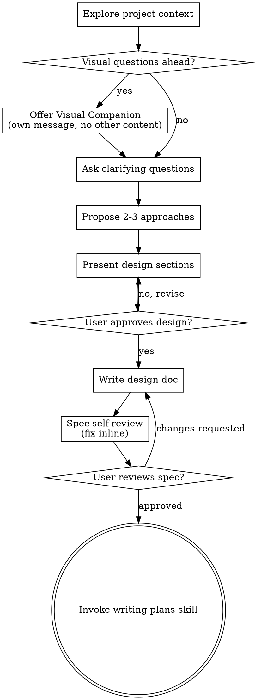

# Brainstorming Ideas Into Designs

Help turn ideas into fully formed designs and specs through natural collaborative dialogue.

Start by understanding the current project context, then ask questions one at a time to refine the idea. Once you understand what you're building, present the design and get user approval.

## Triage: Does This Need a Design?

**User's stated tier takes precedence.** If the user declared a tier when invoking this skill (e.g. "/brainstorming rfc", "/brainstorming spec", or said "this is a research script" in their message), adopt it without re-classifying. Only self-classify when the user gave no signal.

When self-classifying, the project's AGENTS.md is the authority for tier boundaries; default to the heavier tier if ambiguous.

| Tier | User signal (any of) | Process |
|------|----------------------|---------|
| **Trivial** | "fix", "tweak", "typo", bug fix, param change, single-function edit | Skip this skill. Go straight to implementation with appropriate verification. |
| **Research script** | "rfc script" / "research script" / new diagnostic / one-off analysis (see AGENTS.md "研究脚本 run-and-verify") | Lightweight mode: clarify goal + sanity criteria only. No spec doc. Go to writing-plans with run-and-verify tier. |
| **Shared library / spec** | "spec" / shared-library build, code imported by ≥2 callers, or spec pins formulas to field level (see AGENTS.md "共享库 TDD") | Full process: this skill's complete checklist → spec doc → writing-plans with TDD tier. |
| **RFC** | "rfc" / decision / standard / governance / no code change / defines a rule or criteria | Decision mode: see RFC Branch below. Produces an RFC, not a spec+plan. |

**No exceptions:** If you skip this skill for a Trivial task, you still must classify its verification tier (see writing-plans) before implementing.

## Checklist

You MUST create a task for each of these items and complete them in order:

1. **Triage** — adopt the user's stated tier if they declared one (e.g. "rfc" / "spec" / "research script" in their invocation or message); otherwise self-classify into Trivial / Research script / Shared library / Decision-governance (see Triage section). Steps 2-9 below apply ONLY to the Shared-library tier. Research-script tier: jump to step 3 (clarify) then skip to terminal writing-plans. Decision-governance tier: skip to RFC Branch. Trivial tier: skip this skill entirely.
2. **Explore project context** — check files, docs, recent commits
3. **Offer visual companion** (if topic will involve visual questions) — this is its own message, not combined with a clarifying question. See the Visual Companion section below.
4. **Ask clarifying questions** — one at a time, understand purpose/constraints/success criteria
5. **Propose 2-3 approaches** — with trade-offs and your recommendation
6. **Present design** — in sections scaled to their complexity, get user approval after each section
7. **Write design doc** — save to `docs/superpowers/specs/YYYY-MM-DD-<topic>-design.md` and commit
8. **Spec self-review** — quick inline check for placeholders, contradictions, ambiguity, scope (see below)
9. **User reviews written spec** — ask user to review the spec file before proceeding
10. **Transition to implementation** — see Terminal State: invoke `writing-plans` (shared-library build) or produce RFC (decision/governance, terminal)

## Process Flow



## Terminal State

Brainstorming ends in ONE of three ways — choose by tier (see Triage above):

1. **Shared-library build** → write spec doc → invoke `writing-plans`
2. **Decision / standard / governance** → write RFC doc (TERMINAL; no plan follows — see RFC Branch below)
3. **Research-script lightweight mode** → invoke `writing-plans` directly (no spec doc)

Do NOT invoke any other implementation skill directly (frontend-design, mcp-builder, etc.). The only downstream skills are `writing-plans` (for build work) or none (for RFC terminal).

## The Process

**Understanding the idea:**

- Check out the current project state first (files, docs, recent commits)
- Before asking detailed questions, assess scope: if the request describes multiple independent subsystems (e.g., "build a platform with chat, file storage, billing, and analytics"), flag this immediately. Don't spend questions refining details of a project that needs to be decomposed first.
- If the project is too large for a single spec, help the user decompose into sub-projects: what are the independent pieces, how do they relate, what order should they be built? Then brainstorm the first sub-project through the normal design flow. Each sub-project gets its own spec → plan → implementation cycle.
- For appropriately-scoped projects, ask questions one at a time to refine the idea
- Prefer multiple choice questions when possible, but open-ended is fine too
- Only one question per message - if a topic needs more exploration, break it into multiple questions
- Focus on understanding: purpose, constraints, success criteria

**Exploring approaches:**

- Propose 2-3 different approaches with trade-offs
- Present options conversationally with your recommendation and reasoning
- Lead with your recommended option and explain why

**Presenting the design:**

- Once you believe you understand what you're building, present the design
- Scale each section to its complexity: a few sentences if straightforward, up to 200-300 words if nuanced
- Ask after each section whether it looks right so far
- Cover: architecture, components, data flow, error handling, testing
- Be ready to go back and clarify if something doesn't make sense

**Design for isolation and clarity:**

- Break the system into smaller units that each have one clear purpose, communicate through well-defined interfaces, and can be understood and tested independently
- For each unit, you should be able to answer: what does it do, how do you use it, and what does it depend on?
- Can someone understand what a unit does without reading its internals? Can you change the internals without breaking consumers? If not, the boundaries need work.
- Smaller, well-bounded units are also easier for you to work with - you reason better about code you can hold in context at once, and your edits are more reliable when files are focused. When a file grows large, that's often a signal that it's doing too much.

**Working in existing codebases:**

- Explore the current structure before proposing changes. Follow existing patterns.
- Where existing code has problems that affect the work (e.g., a file that's grown too large, unclear boundaries, tangled responsibilities), include targeted improvements as part of the design - the way a good developer improves code they're working in.
- Don't propose unrelated refactoring. Stay focused on what serves the current goal.

## After the Design

**Documentation:**

- Write the validated design (spec) to `docs/superpowers/specs/YYYY-MM-DD-<topic>-design.md`
  - **Spec 必须用中文编写**（标题、章节名、正文、表格、decision 都用中文；代码、命令、文件路径、标识符保留原文）
  - (User preferences for spec location override this default)
- Commit the design document to git

**Spec Self-Review:**
After writing the spec document, look at it with fresh eyes:

1. **Placeholder scan:** Any "TBD", "TODO", incomplete sections, or vague requirements? Fix them.
2. **Internal consistency:** Do any sections contradict each other? Does the architecture match the feature descriptions?
3. **Scope check:** Is this focused enough for a single implementation plan, or does it need decomposition?
4. **Ambiguity check:** Could any requirement be interpreted two different ways? If so, pick one and make it explicit.

Fix any issues inline. No need to re-review — just fix and move on.

**User Review Gate:**
After the spec review loop passes, ask the user to review the written spec before proceeding:

> "Spec written and committed to `<path>`. Please review it and let me know if you want to make any changes before we start writing out the implementation plan."

Wait for the user's response. If they request changes, make them and re-run the spec review loop. Only proceed once the user approves.

**Implementation:**

The transition depends on the tier (see Triage and Terminal State above):

- **Shared-library build** (spec doc written & approved) → invoke `writing-plans` with TDD tier
- **Research-script lightweight mode** (no spec doc) → invoke `writing-plans` with run-and-verify tier directly
- **Decision / standard / governance** → RFC is terminal. Do NOT invoke writing-plans. See RFC Branch below.

Do NOT invoke any other implementation skill (frontend-design, mcp-builder, etc.).

## RFC Branch (Decision / Standard / Governance)

When the outcome is a decision, standard, or governance rule — not a build task — produce an RFC instead of a spec+plan. Examples: promotion/demotion criteria, status tiers, methodology standards, cross-sector conventions, naming rules.

**Save RFCs to:** `docs/superpowers/rfcs/YYYY-MM-DD-<topic>.md`

**RFC 必须用中文编写**（标题、章节名、正文、表格、决策内容都用中文；代码、命令、文件路径、标识符保留原文）。

**RFC 结构模板：**

```markdown
# [标题]

> **状态**: Draft | Accepted | Superseded
> **日期**: YYYY-MM-DD
> **范围**: [本 RFC 治理什么]

## 背景
[为什么现在需要这个决策]

## 目标
[本 RFC 要回答的问题]

## [决策正文]
[标准、分层、规则、表格 —— 实际的规范内容]

## 非目标
[本 RFC 明确不做决定的部分]
```

**An RFC is a terminal deliverable.** It does NOT transition to writing-plans. Any concrete build work that follows from an accepted RFC gets its own brainstorming → spec → plan cycle, scoped to one task.

## Key Principles

- **One question at a time** - Don't overwhelm with multiple questions
- **Multiple choice preferred** - Easier to answer than open-ended when possible
- **YAGNI ruthlessly** - Remove unnecessary features from all designs
- **Explore alternatives** - Always propose 2-3 approaches before settling
- **Incremental validation** - Present design, get approval before moving on
- **Be flexible** - Go back and clarify when something doesn't make sense

## Visual Companion

A browser-based companion for showing mockups, diagrams, and visual options during brainstorming. Available as a tool — not a mode. Accepting the companion means it's available for questions that benefit from visual treatment; it does NOT mean every question goes through the browser.

**Offering the companion:** When you anticipate that upcoming questions will involve visual content (mockups, layouts, diagrams), offer it once for consent:
> "Some of what we're working on might be easier to explain if I can show it to you in a web browser. I can put together mockups, diagrams, comparisons, and other visuals as we go. This feature is still new and can be token-intensive. Want to try it? (Requires opening a local URL)"

**This offer MUST be its own message.** Do not combine it with clarifying questions, context summaries, or any other content. The message should contain ONLY the offer above and nothing else. Wait for the user's response before continuing. If they decline, proceed with text-only brainstorming.

**Per-question decision:** Even after the user accepts, decide FOR EACH QUESTION whether to use the browser or the terminal. The test: **would the user understand this better by seeing it than reading it?**

- **Use the browser** for content that IS visual — mockups, wireframes, layout comparisons, architecture diagrams, side-by-side visual designs
- **Use the terminal** for content that is text — requirements questions, conceptual choices, tradeoff lists, A/B/C/D text options, scope decisions

A question about a UI topic is not automatically a visual question. "What does personality mean in this context?" is a conceptual question — use the terminal. "Which wizard layout works better?" is a visual question — use the browser.

If they agree to the companion, read the detailed guide before proceeding:
`skills/brainstorming/visual-companion.md`
